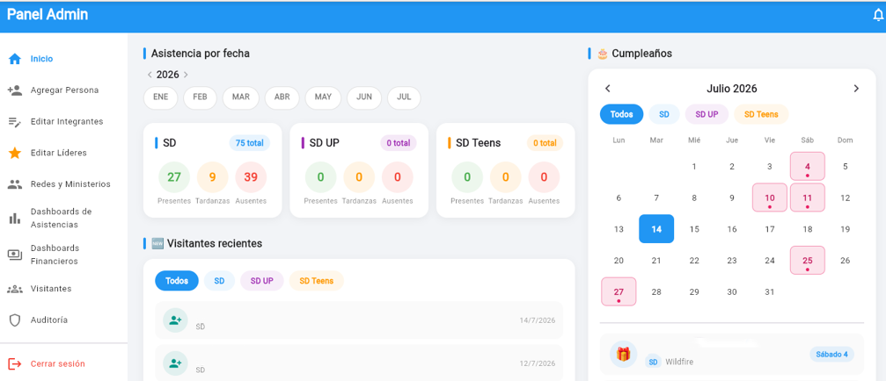
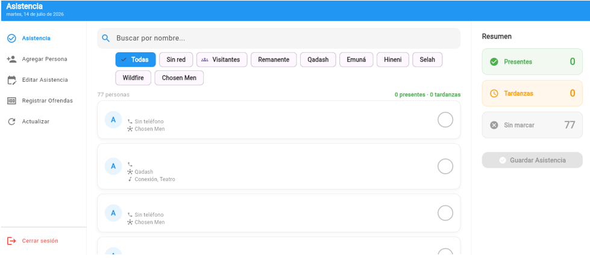
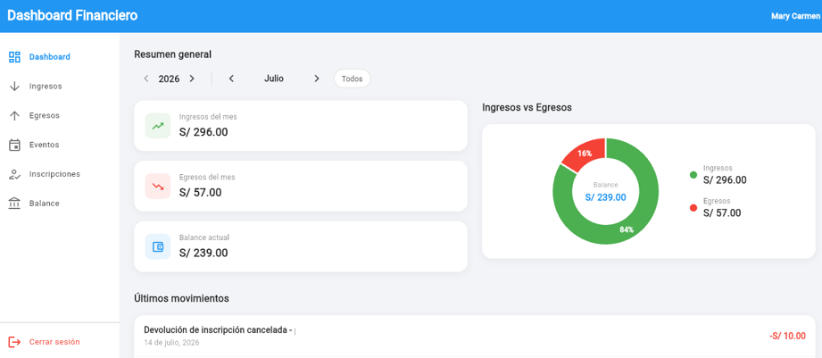
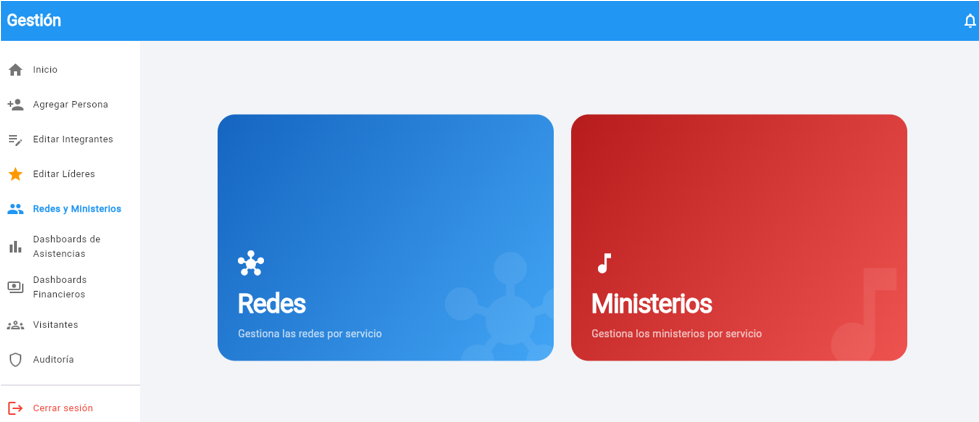
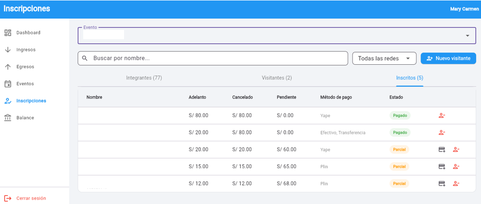
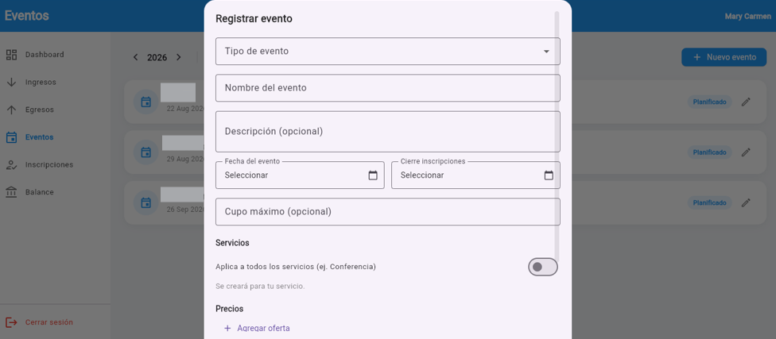
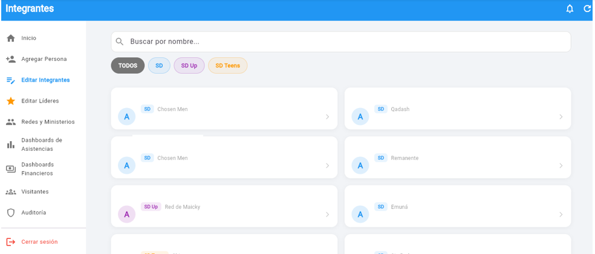
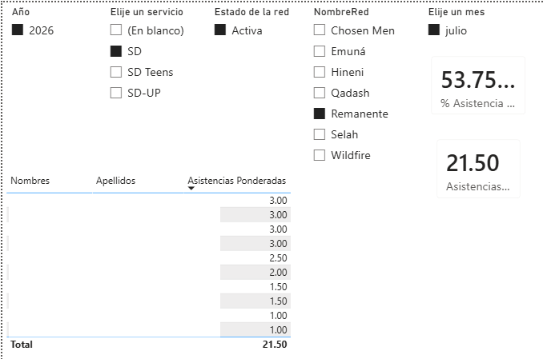
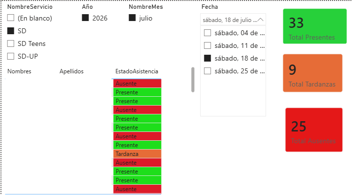
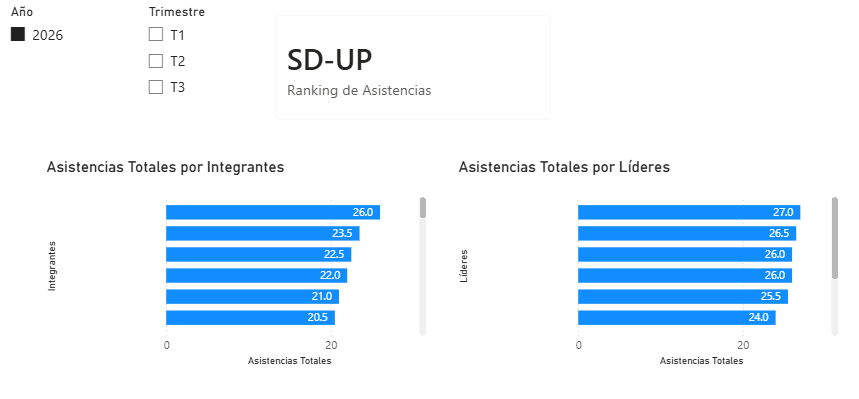

# CheckSD — Sistema de Gestión Integral

Sistema de información multiplataforma para el área juvenil "Somos Diferentes" de la Misión Cristiana Luz Divina, que digitaliza el registro de asistencia y la gestión financiera de la organización.

> El código fuente del backend y frontend se mantiene privado por tratarse de un sistema en producción con datos reales de personas. Este repositorio documenta el proyecto: arquitectura, decisiones técnicas y capturas de pantalla.

## El problema

Antes de CheckSD, la organización operaba de forma completamente manual:

- **Asistencia**: registrada en hojas de Excel por el ministerio de turno, sin forma de saber quién asiste regularmente o quién se está alejando.
- **Finanzas**: diezmos, ofrendas y gastos de los 3 servicios (SD, SD UP, SD Teens) sin ningún registro estructurado ni historial.
- **Eventos**: inscripciones y pagos manejados de forma verbal, sin control de montos pendientes.

## La solución

Un sistema centralizado, en tiempo real y multiplataforma (Android + Web), que reemplaza estos procesos manuales por un flujo digital con roles, validaciones automáticas y reportes.

## Arquitectura

```
Flutter (APK Android / Web en Netlify)
          │  JWT
          ▼
ASP.NET Core 10 API REST  (Azure App Service — Canada Central)
          │  Entity Framework Core
          ▼
SQL Server  (Azure SQL Database — Brazil South)
```

- **Frontend**: Flutter, una única base de código compilada como APK (registro presencial de asistencia) y como Web (dashboards para líderes/administradores, accesible también desde iOS sin instalación).
- **Backend**: ASP.NET Core 10 + Entity Framework Core, arquitectura en 3 capas, autenticación JWT con roles diferenciados (Administrador, Líder, Líder de Apoyo, Encargado).
- **Base de datos**: SQL Server en Azure SQL Database — 29 tablas normalizadas en 3 módulos funcionales (Seguridad, Gestión Organizacional y Asistencia, Eventos y Finanzas).

## Seguridad

- Contraseñas almacenadas con hash **bcrypt** (nunca en texto plano).
- Autorización declarativa por rol en cada endpoint (`[Authorize(Roles="...")]`).
- Tabla de **auditoría de accesos** — registra login/logout/intentos fallidos con IP y dispositivo.
- Backups automáticos de Azure SQL Database con retención de 7 días.
- Integridad referencial completa mediante Foreign Keys en todas las relaciones.

## Funcionalidades principales

- Gestión de integrantes, redes, ministerios y liderazgos
- Registro y seguimiento de asistencia por servicio, con historial individual
- Módulo financiero: ingresos (diezmos, ofrendas), egresos categorizados, balance por servicio
- Gestión de eventos: inscripciones, precios escalonados, lista de espera, seguimiento de pagos
- Dashboards estadísticos por período, red y ministerio
- Módulo de auditoría y notificaciones

## Capturas de Pantalla

### App — Panel de Administrador


### App — Registro de Asistencia (Encargado)


### App — Panel del Líder


### App — Gestión de Redes y Ministerios


### App — Inscripciones a Eventos


### App — Registro de Eventos de la Organización


### App — Filtro de Personas por Servicio


### Power BI — Porcentaje y Total de Asistencias por Redes


### Power BI — Asistencia Detallada de Cada Sábado


### Power BI — Ranking Top 5 Integrantes y Líderes


## Mi rol

Diseñé y desarrollé el sistema completo de forma independiente (proyecto de 2 integrantes a nivel universitario, con mi compañera colaborando en la parte documentaria):

- Diseño desde cero del modelo de datos relacional normalizado (29 tablas).
- Desarrollo completo de la API REST, incluyendo autenticación y autorización por roles.
- Identifiqué y corregí una falla de autorización en producción, migrando la validación de un campo de negocio a autorización declarativa por rol.
- Desarrollo del frontend Flutter con arquitectura en capas (Screens → Providers → Services).
- Despliegue en Azure (App Service + SQL Database) y Netlify.
- Migración de los reportes de asistencia a dashboards en **Power BI**, con medidas DAX y matriz de calor por red/mes.

## Stack Tecnológico

`Flutter` · `Dart` · `ASP.NET Core 10` · `C#` · `Entity Framework Core` · `SQL Server` · `Azure SQL Database` · `Azure App Service` · `JWT` · `Netlify` · `Git/GitHub` · `Power BI`

## Metodología

Desarrollo iterativo por Sprints, con ramas de feature independientes en GitHub (`main` + `feature/*`), permitiendo seguir mejorando el sistema sin afectar la versión en uso por la organización.

---

📄 Documentación académica completa disponible bajo solicitud.
💼 [LinkedIn](https://www.linkedin.com/in/paolo-mejia-43718b38a/)
